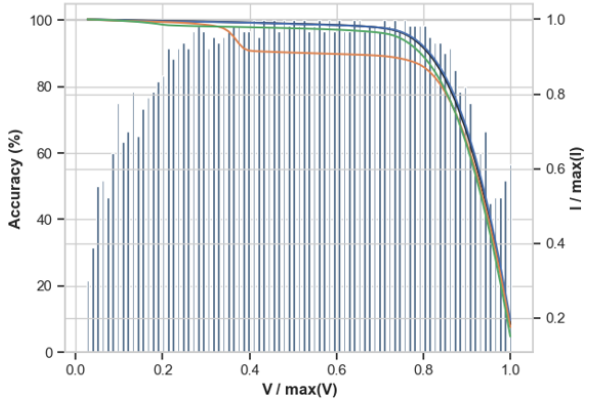

Projects
========

Utilizing PCA on Photovoltaic current-voltage (IV) curves improves the performance of a failure classification task. Observing the performance of a random forest classifier on point-wise classification shows better results where the IV curve profile more often contains failure trends.

