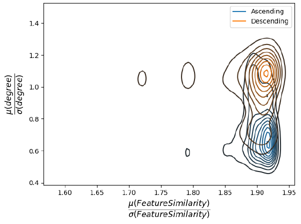
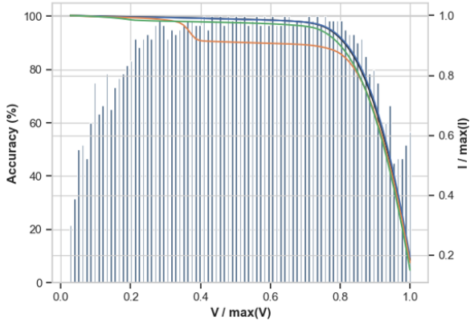
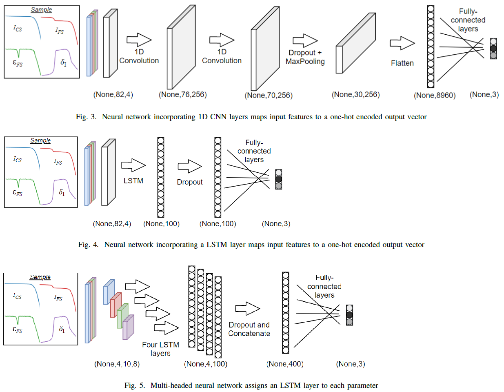
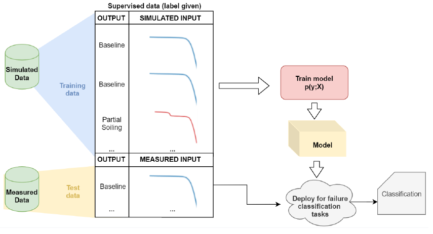
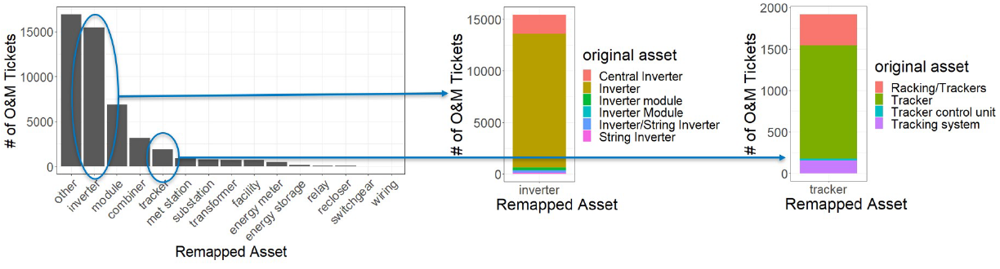
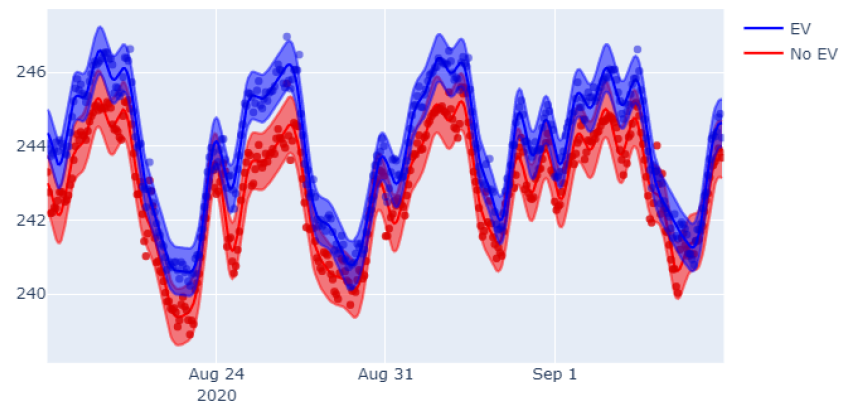
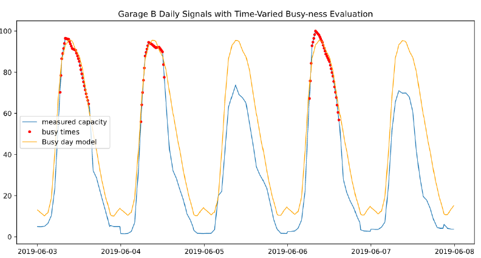

Projects
========

Exploring a link between network topology and active learning
################

Active learning in graph neural networks can provide similar, if not better, results in a node classification task simply by ordering the input data in the training process. An ordering process is studied and an empirical rule-of-thumb is established to infer the best ordering based off the topology of the network. This work was formalized in a `peer-review paper <https://www.mdpi.com/2078-2489/12/4/170>`_ and a `conference paper <http://icufn.org/wp-content/uploads/2021/08/ICUFN-2021-Final-Program-Version-Revised.pdf>`_.

`An assessment of the value of principal component analysis for photovoltaic IV trace classification of physically-induced failures <https://ieeexplore.ieee.org/document/9300601>`_
################

Utilizing PCA on Photovoltaic current-voltage (IV) curves improves the performance of a failure classification task. Observing the performance of a random forest classifier on point-wise classification shows better results where the IV curve profile more often contains failure trends. Thi work was presented at PVSC47 conference in 2020 and won best student `presentation <https://github.com/MichaelHopwood/HopML/blob/main/docs/_static/pvsc47_ppt.pdf>`_ and `paper <https://ieeexplore.ieee.org/abstract/document/9300601>`_.

`Neural network-based classification of string-level IV curves from physically-induced failures of photovoltaic modules <https://ieeexplore.ieee.org/abstract/document/9186596>`_
################

A classification task of photovoltaic failures using photovoltaic current-voltage (IV) curves is answered through neural networks, specifically a single-headed LSTM, multi-headed LSTM, and 1D CNN. Results show high accuracy (99%+) in the classification of three common failures which were physically induced in a real system. This study established a methodology which could be applied to a larger list of failures in more complicated systems. This work was formalized in a peer-review `journal paper <https://ieeexplore.ieee.org/abstract/document/9186596>`_.

Physics-based method for generating fully synthetic IV curve training datasets for machine learning classification of PV failures
################

To circumvent having to induce failures in real systems for data collection (as done in the study above), a physics-based simulation framework is built. Results show no difference in a failure classification task (evaluated on measured data) when using simulations or real measured data in training. The code was released `here <https://github.com/sandialabs/pvOps>`_ and a paper is pending review from a journal.

pvOps: Improving Operational Assessments through Data Fusion
################

Two (PVSC & `AGU <https://ui.adsabs.harvard.edu/abs/2020AGUFMIN0140003H/abstract>`_) conference proceedings introduce a python package which preprocesses text (Operations and maintenance tickets) and time (timeseries meteorological and electrical) data for the purpose of better-informed knowledge retrieval. Data preprocessing steps were established for both types of data. Results show distributions of failure frequencies and failure impacts on system production.

Electric Vehicle Detection
##########################

Through a competition with an energy utility provider, a detection task was conducted to identify whether a household had an electric vehicle (EV). Our results showed an accuracy of 82.4% which beat our competitor's results (~70%). Outside of the data provided in the competition, we found data from the United Nations online which helped capture global trends in EV. Data smoothing and enemble models were conducted to establish the prediction. A white paper was written and submitted to the company which is covered by an NDA.

Generalized Low-Rank Models for Parking Garage Capacity Modeling
#######################

Participation in a Stanford hackathon for a few hours was conducted studying the parking capacity levels across different garages at UCF. A GLRM was built to summarize a model which best fit busy-day conditions that way deviations from this model would symbolize smaller-than-normal capacity given the time of day. Specifically, a set of regularization methods were adopted to minimize the construction loss where a busy day is mandated to be smooth, parabolic, and similar to other busy days. The results generated interesting garage-specific profiles; additionally, garage capacity changes due to covid were analyzed. The `code <https://github.com/MichaelHopwood/UCFParkingAI>`_ and `paper <https://github.com/MichaelHopwood/HopML/blob/main/docs/_static/UCFParkingAI.pdf>`_ are available online.

